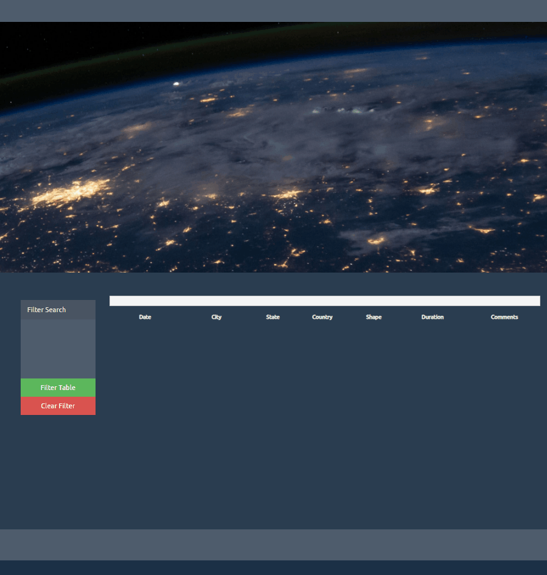

# UFO Sighting Webpage

## Background

This project requires a webpage that allow users to search for UFO sighting based on [provided dataset](UFO-level-1/static/js/data.js).

## Tasks completed
Three type of searches are provided to users:
- Option 1: Automatic Table and Date Search 
The webpage will listen for events and search through the `date/time` column to find rows that match user input (see [script](UFO-Option-1-Date_input_method/static/js/app.js)) 

- Option 2: Using multiple `input` tags (see [script](UFO-Option-2-Input_filter_method/static/js/app.js)) 

- Option 3: Using multiple `select` dropdowns (see [script](UFO-Option-3-Select_filter_method/static/js/app.js)) 
For this option a live webpage was deployed on GitHub [UFO finder website](https://realdreammaker.github.io/UFO-Sighting-Webpage/)

